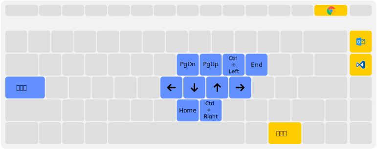

# AutoHotKey

这是我个人提升生产力的Autohotkey套件。

## 快捷键绑定

*这是笔记本键盘布局*

### 全局

* <kbd>Caps lock</kbd>+<kbd>h</kbd>：左。
* <kbd>Caps lock</kbd>+<kbd>j</kbd>：下。
* <kbd>Caps lock</kbd>+<kbd>k</kbd>：上。
* <kbd>Caps lock</kbd>+<kbd>l</kbd>：右。
* <kbd>Caps lock</kbd>+<kbd>Shift</kbd>：配合<kbd>h</kbd><kbd>j</kbd><kbd>k</kbd><kbd>l</kbd>可进行移动选择。
* <kbd>Caps lock</kbd>+<kbd>u</kbd>：PgDn。
* <kbd>Caps lock</kbd>+<kbd>i</kbd>：PgUp。
* <kbd>Caps lock</kbd>+<kbd>o</kbd>：行头。
* <kbd>Caps lock</kbd>+<kbd>m</kbd>：行尾。
* <kbd>Caps lock</kbd>+<kbd>p</kbd>：End。
* <kbd>Caps lock</kbd>+<kbd>n</kbd>：Home。
* <kbd>RCtrl</kbd>+<kbd>Delete</kbd>：打开 Chrome 浏览器。
* <kbd>RCtrl</kbd>+<kbd>Home</kbd>：打开 Hotmail 的网页版。
* <kbd>RCtrl</kbd>+<kbd>End</kbd>：打开 Visual Studio Code 应用。

### Cmd

* <kbd>Ctrl</kbd>+<kbd>v</kbd>：粘贴。
* <kbd>Ctrl</kbd>+<kbd>v</kbd>：清除屏幕。

## 使用

* 下载安装[Authotkey](https://autohotkey.com/)
* `git clone https://github.com/xiashuangxi/AutoHotkey.git`
* 运行`Main.ahk`

## 开源协议

